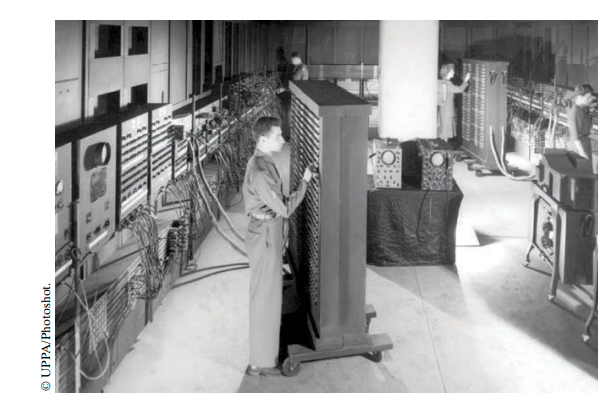
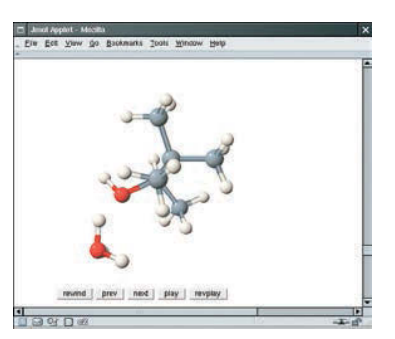

# CHAPTER 1 INTRODUCTION
## 1.1 Computer Program

 <i> You have probably used a computer for work or fun. Many people use computers for everyday tasks such as electronic banking or writing a term paper. Computers are good for such tasks. They can handle repetitive chores, such as totaling up numbers or placing words on a page, without getting bored or exhausted.</i>

 Anda mungkin pernah menggunakan komputer untuk bekerja atau bersenang-senang. Banyak orang menggunakan komputer untuk tugas sehari-hari seperti perbankan elektronik atau menulis makalah. Komputer adalah baik untuk tugas-tugas seperti itu. Mereka dapat menangani tugas berulang, seperti menjumlahkan angka atau menempatkan kata-kata di halaman, tanpa merasa bosan atau lelah.

 <i>The flexibility of a computer is quite an amazing phenomenon. The same machine can balance your checkbook, lay out your term paper, and play a game. In contrast, other machines carry out a much narrower range of tasks; a car drives and a toaster toasts. Computers can carry out a wide range of tasks because they execute different programs, each of which directs the computer to work on a specific task.</i>

 Fleksibilitas komputer adalah fenomena yang cukup menakjubkan. Mesin yang sama dapat menyeimbangkan buku cek Anda, meletakkan kertas istilah Anda, dan bermain game. Sebaliknya, mesin lain melakukan berbagai tugas yang jauh lebih sempit; mobil yang dikendarai dan pemanggang roti bersulang. Komputer dapat melakukan berbagai tugas karena mereka menjalankan tugas yang berbeda program, yang masing-masing mengarahkan komputer untuk bekerja pada tugas tertentu.

 <i> The computer itself is a machine that stores data (numbers, words, pictures), interacts with devices (the monitor, the sound system, the printer), and executes programs. A computer program tells a computer, in minute detail, the sequence of steps that are Needed to fulfill a task. The physical computer and peripheral devices are collectively called the hardware. The programs the computer executes are called the software.
</i>

 Komputer itu sendiri adalah mesin yang menyimpan data (angka, kata-kata, gambar), berinteraksi dengan perangkat (monitor, sistem suara, printer), dan menjalankan program. Sebuah program komputer memberi tahu komputer, secara rinci, urutan langkah-langkah yang diperlukan untuk memenuhi tugas. Komputer fisik dan perangkat periferal secara kolektif disebut perangkat keras. Program yang dijalankan komputer disebut barang lunak.

 <i>Called the hardware. The programs the computer executes are called the software. Today’s computer programs are so sophisticated that it is hard to believe that they are composed of extremely primitive instructions. A typical instruction may be one of the following:

• Put a red dot at a given screen position.
• Add up two numbers.
• If this value is negative, continue the program at a certain instruction

The computer user has the illusion of smooth interaction because a program contains a huge number of such instructions, and because the computer can execute them at great speed.
</i>

Program komputer saat ini sangat canggih sehingga sulit dipercaya bahwa mereka terdiri dari instruksi yang sangat primitif. Instruksi tipikal mungkin satu dari berikut ini:
* Letakkan titik merah pada posisi layar tertentu.
* Tambahkan dua angka.
* Jika nilai ini negatif, lanjutkan program pada instruksi tertentu.
  
Pengguna komputer memiliki ilusi interaksi yang lancar karena sebuah program berisi sejumlah besar instruksi semacam itu, dan karena komputer dapat mengeksekusinya di kecepatan luar biasa.

<i> The act of designing and implementing computer programs is called programming. In this book, you will learn how to program a computer—that is, how to direct the computer to execute tasks.
</i>

 Tindakan merancang dan mengimplementasikan program komputer disebut pemrograman. Dalam buku ini, Anda akan belajar cara memprogram komputer yaitu cara mengarahkan komputer untuk menjalankan tugas.

<i> To write a computer game with motion and sound effects or a word processor that supports fancy fonts and pictures is a complex task that requires a team of many highly-skilled programmers. Your first programming efforts will be more mundane. The concepts and skills you learn in this book form an important foundation, and you should not be disappointed if your first programs do not rival the sophisticated software that is familiar to you. Actually, you will find that there is an immense thrill even in simple programming tasks. It is an amazing experience to see the computer precisely and quickly carry out a task that would take you hours of drudgery, to make small changes in a program that lead to immediate improvements, and to see the computer become an extension of your mental powers.
</i>

 Untuk menulis game komputer dengan efek gerakan dan suara atau pengolah kata yang mendukung font dan gambar mewah adalah tugas kompleks yang membutuhkan tim yang terdiri dari banyak orang programmer yang sangat terampil. Upaya pemrograman pertama Anda akan lebih biasa.Konsep dan keterampilan yang Anda pelajari dalam buku ini membentuk fondasi penting, dan Anda tidak boleh kecewa jika program pertama Anda tidak menyaingi sophis ticated perangkat lunak yang akrab bagi Anda. Sebenarnya, Anda akan menemukan bahwa ada sensasi yang luar biasa bahkan dalam tugas pemrograman sederhana. Ini adalah pengalaman yang luar biasa untuk melihat komputerdengan tepat dan cepat melaksanakan tugas yang akan memakan waktu berjam-jam kerja keras, untuk membuat perubahan kecil dalam program yang mengarah pada perbaikan segera, dan untuk melihat komputer menjadi perpanjangan dari kekuatan mental Anda.

1. What is required to play music on a computer?
2. Why is a CD player less flexible than a computer?
3. What does a computer user need to know about programming in order to play a video game?

</i>

1. Apa yang diperlukan untuk memutar musik di komputer?
2. Mengapa pemutar CD kurang fleksibel dibandingkan komputer?
3. Apa yang perlu diketahui pengguna komputer tentang pemrograman agar dapat memainkan video game?

______
## 1. 2 Anatomy of Computer (Anatomi dari Komputer)

<i> To understand the programming process, you need to have a rudimentary undrestanding of the building blocks that make up a computer. We will look at a personal computer. Larger computers have faster, larger, or more powerful components, but they have fundamentally the same design.
</i>

 Untuk memahami proses pemrograman, Anda harus memiliki pemahaman dasar tentang blok bangunan yang membentuk komputer. Kami akan melihat secara pribadikomputer. Komputer yang lebih besar memiliki komponen yang lebih cepat, lebih besar, atau lebih kuat, tetapi mereka pada dasarnya memiliki desain yang sama.

<i> At the heart of the computer lies the central processing unit (CPU) (see Figure 1). The inside wiring of the CPU is enormously complicated. For example, the Intel Core processor (a popular CPU for personal computers at the time of this writing) is composed of several hundred million structural elements, called transistors.
</i>

 Di jantung komputer terletak pusatnya unit pemrosesan (CPU) (lihat Gambar 1). Bagian dalam pengkabelan CPU sangat rumit. Misalnya, prosesor Intel Core (yang populer CPU untuk komputer pribadi pada saat ini tulisan) terdiri dari beberapa ratus juta elemen struktural, yang disebut transistor.

<i> The CPU performs program control and data processing. That is, the CPU locates and executes the program instructions; it carries out arithmetic operations such as addition, subtraction, multiplication, and division; it fetches data from external memory or devices and places processed data into storage. 
</i>

 CPU melakukan kontrol program dan pengolahan data. Artinya, CPU menempatkan dan mengeksekusi instruksi program; itu melaksanakan operasi aritmatika seperti penambahan, pengurangan, perkalian, dan pembagian; itu mengambil data dari memori eksternal atau perangkat dan tempat data yang diproses ke dalam penyimpanan.

<i> There are two kinds of storage. Primary storage, or memory, is made from electronic circuits that can store data, provided they are supplied with electric power. Secondary storage, usually a hard disk (see Figure 2) or a solid-state drive, provides slower and less expensive storage that persists without electricity. A hard disk consists of rotating platters, which are coated with a magnetic material. A solid-state drive uses electronic components that can retain information without power, and without moving parts.
</i>

 Ada dua macam penyimpanan. Penyimpanan primer, atau memori, dibuat dari sirkuit elektronik yang dapat menyimpan data, asalkan: disuplai dengan tenaga listrik. Penyimpanan sekunder, biasanya hard disk (lihat Gambar 2) atau solid-state drive, menyediakan penyimpanan yang lebih lambat dan lebih murah yang bertahan tanpa listrik. Sebuah hard disk terdiri dari piringan berputar, yang dilapisi dengan magnet bahan. Solid-state drive menggunakan komponen elektronik yang dapat menyimpan informasi tanpa daya, dan tanpa bagian yang bergerak. 

_________

<i> To interact with a human user, a computer requires peripheral devices. The computer transmits information (called output) to the user through a display screen, speakers, and printers. The user can enter information (called input) for the computer by using a keyboard or a pointing device such as a mouse.
</i>

  Untuk berinteraksi dengan pengguna manusia, komputer membutuhkan perangkat periferal. Komputer mengirimkan informasi (disebut output) kepada pengguna melalui layar tampilan, speaker, dan printer. Pengguna dapat memasukkan informasi (disebut input) untuk komputer dengan menggunakan keyboard atau alat penunjuk seperti mouse.

<i> Some computers are self-contained units, whereas others are interconnected through networks. Through the network cabling, the computer can read data and programs from central storage locations or send data to other computers. To the user of a networked computer, it may not even be obvious which data reside on the computer itself and which are transmitted through the network. 
</i>

 Beberapa komputer adalah unit mandiri, sedangkan yang lain saling berhubungan melalui jaringan. Melalui kabel jaringan, komputer dapat membaca data dan program dari lokasi penyimpanan pusat atau mengirim data ke komputer lain. Untuk pengguna dari komputer jaringan, bahkan mungkin tidak jelas data mana yang berada di komputer itu sendiri dan mana yang ditransmisikan melalui jaringan.

<i> Figure 3 gives a schematic overview of the architecture of a personal computer. Program instructions and data (such as text, numbers, audio, or video) reside in secondary storage or elsewhere on the network. When a program is started, its instructions are brought into memory, where the CPU can read them. The CPU reads and executes one instruction at a time. As directed by these instructions, the CPU reads data, modifies it, and writes it back to memory or secondary storage. Some program instructions will cause the CPU to place dots on the display screen or printer or to vibrate the speaker. As these actions happen many times over and at great speed, the human user will perceive images and sound. Some program instructions read user input from the keyboard, mouse, touch sensor, or microphone. The program analyzes the nature of these inputs and then executes the next appropriate instruction.
</i>

  Gambar 3 memberikan gambaran skematis arsitektur komputer pribadi. Instruksi dan data program (seperti teks, angka, audio, atau video) berada di penyimpanan sekunder atau di tempat lain di jaringan. Ketika sebuah program dimulai, instruksinya dibawa ke memori, di mana CPU dapat membacanya. CPU membaca dan mengeksekusi satu instruksi pada suatu waktu. Seperti yang diarahkan oleh instruksi ini, CPU membaca data, memodifikasinya, dan menulisnya kembali ke memori atau penyimpanan sekunder. Beberapa program instruksi akan menyebabkan CPU menempatkan titik-titik pada layar tampilan atau printer atau untuk getarkan speakernya. Karena tindakan ini terjadi berkali-kali dan dengan kecepatan tinggi, pengguna manusia akan melihat gambar dan suara. Beberapa instruksi program membaca pengguna masukan dari keyboard, mouse, sensor sentuh, atau mikrofon. Program menganalisis sifat input ini dan kemudian mengeksekusi instruksi berikutnya yang sesuai.

____________

<i> 
1. Where is a program stored when it is not currently running?
2. Which part of the computer carries out arithmetic operations, such as addition and multiplication?
3. A modern smartphone is a computer, comparable to a desktop computer. Which components of a smartphone correspond to those shown in Figure 3?

</i>

4. Di mana program disimpan saat sedang tidak berjalan?
5. Bagian komputer mana yang melakukan operasi aritmatika, seperti penjumlahan dan perkalian?
6. Smartphone modern adalah komputer, sebanding dengan komputer desktop. Yang komponen smartphone sesuai dengan yang ditunjukkan pada Gambar 3?
 

__________

### *Computing & Society 1.1 Computers Are Everywhere*

<i> When computers were first invented in the 1940s, a computer filled an entire room. The photo below shows the ENIAC (electronic numerical integrator and computer), completed in 1946 at the University of Pennsylvania. The ENIAC was used by the military to compute the trajectories of projectiles. Nowadays, computing facilities of search engines, Internet shops, and social networks fill huge buildings called data centers. At the other end of the spectrum, computers are all around us. Your cell phone has a computer inside, as do many credit cards and fare cards for public transit. A modern car has several computers––to control the engine, brakes, lights, and the radio.</i>

 Ketika komputer pertama kali ditemukan pada tahun 1940-an, sebuah komputer mengisi seluruh ruangan. Foto di bawah ini menunjukkan ENIAC (integrator numerik elektronik dan komputer), selesai dalam 1946 di Universitas Pennsylvania. ENIAC digunakan oleh militer untuk menghitung lintasan peluru. Saat ini, fasilitas komputasi mesin pencari, toko Internet, dan jejaring sosial memenuhi gedung-gedung besar disebut pusat data. Di ujung lain spektrum, komputer ada di mana-mana kita. Ponsel Anda memiliki komputer di dalam, seperti halnya banyak kartu kredit dan ongkos kartu untuk angkutan umum. Sebuah mobil modern memiliki beberapa komputer––untuk mengontrol mesin, rem, lampu, dan radio.

<i> The advent of ubiquitous computing changed many aspects of our lives. Factories used to employ people to do repetitive assembly tasks that are today carried out by computercontrolled robots, operated by a few people who know how to work with those computers. Books, music, and movies nowadays are often consumed on computers, and computers are almost always involved in their production. The book that you are reading right now could not have been written without computers.</i>

 Munculnya komputasi di mana-mana berubah banyak aspek dari kami hidup. Pabrik digunakan mempekerjakan orang untuk lakukan perakitan berulang tugas hari ini dilakukan oleh robot yang dikendalikan komputer, dioperasikan oleh beberapa orang yang tahu cara bekerja dengan komputer-komputer itu. Buku, musik, dan film saat ini sering dikonsumsi pada komputer, dan komputer adalah hampir selalu terlibat dalam produksi mereka. Buku yang kamu sedang membaca sekarang tidak dapat ditulis tanpa komputer.

______

<i>  how to program them has become an essential skill in many careers. Engineers design computer-controlled
cars and medical equipment that preserve lives. Computer scientists develop programs that help people come together to support social causes. For example, activists used social networks to share videos showing abuse by repressive regimes, and this information was instrumental in changing public opinion.
</i>

 Bagaimana memprogram mereka telah menjadi keterampilan penting dalam banyak karir. Insinyur merancang komputer yang dikendalikan mobil dan peralatan medis yang melestarikan kehidupan. Ilmuwan komputer mengembangkan program yang membantu orang berkumpul untuk mendukung sosialpenyebab. Misalnya, aktivis menggunakan jejaring sosial untuk berbagi video menunjukkan penyalahgunaan oleh rezim represif, dan informasi ini sangat penting dalam mengubah opini publik.

<i> As computers, large and small, become ever more embedded in our everyday lives, it is increasingly important for everyone to understand how they work, and how to work with them. As you use this book to learn how toprogram a computer, you will develop a good understanding of computing fundamentals that will make you a more informed citizen and, perhaps, a computing professional.
</i>

 Sebagai komputer, besar dan kecil, menjadi semakin tertanam dalam kami kehidupan sehari-hari, semakin penting bagi setiap orang untuk memahami caranya mereka bekerja, dan bagaimana bekerja dengan mereka. Saat Anda menggunakan buku ini untuk mempelajari caranya memprogram komputer, Anda akan mengembangkan pemahaman yang baik tentang komputasi dasar yang akan membuat Anda warga negara yang lebih berpengetahuan dan, mungkin, seorang profesional komputasi.

## *1.3 The Java Programming Languange*
## 1.3 Bahasa Pemrograman Java

<i> In order to write a computer program, you need to provide a sequence of instructions that the CPU can execute. A computer program consists of a large number of simple CPU instructions, and it is tedious and error-prone to specify them one by one. For that reason, high-level programming languages have been created. In a high-level language, you specify the actions that your program should carry out. A compiler translates the high-level instructions into the more detailed instructions (called machine code)required by the CPU. Many different programming languages have been designed for different purposes.
</i>

  Untuk menulis program komputer, Anda perlu memberikan urutan instruksi yang dapat dijalankan oleh CPU. Sebuah program komputer terdiri dari sejumlah besar instruksi CPU, dan itu membosankan dan rawan kesalahan untuk menentukannya satu per satu. Untuk Oleh karena itu, bahasa pemrograman tingkat tinggi telah dibuat. Dalam tingkat tinggi bahasa, Anda menentukan tindakan yang harus dilakukan program Anda. Kompilato menerjemahkan instruksi tingkat tinggi ke dalam instruksi yang lebih rinci (disebut kode mesin) yang dibutuhkan oleh CPU. Banyak bahasa pemrograman yang berbeda memiliki telah dirancang untuk tujuan yang berbeda.

<i> designed a programming language, code-named “Green”, for use in consumer devices, such as intelligent television “set-top” boxes. The language was designed to be simple, secure, and usable for many different processor types. No customer was ever found for this technology.</i>

 Merancang bahasa pemrograman, dengan nama kode "Hijau", untuk digunakan di konsumen perangkat, seperti kotak "set-top" televisi cerdas. Bahasa itu dirancang untuk sederhana, aman, dan dapat digunakan untuk berbagai jenis prosesor. Tidak ada pelanggan pernah ditemukan untuk teknologi ini.

<i> Gosling recounts that in 1994 the team realized, “We could write a really cool browser. It was one of the few things in the client/server mainstream that needed some of the weird things we’d done: architecture neutral, real-time, reliable, secure.” Java was introduced to an enthusiastic crowd at the SunWorld exhibition in 1995, together with a browser that ran applets—Java code that can be located anywhere on the Internet. The figure at right shows a typical example of an applet. </i>

 Gosling menceritakan bahwa pada tahun 1994 tim menyadari, “Kita bisa menulis browser yang sangat keren. Itu satu dari beberapa hal dalam arus utama klien/server yang membutuhkan beberapa hal aneh yang telah kami lakukan: arsitektur netral, real-time, andal, aman.” Java diperkenalkan kepada orang banyak yang antusias di pameran SunWorld pada tahun 1995, bersama dengan a browser yang menjalankan applet—kode Java yang dapat terletak di mana saja di Internet. Sosok di kanan menunjukkan contoh khas applet.

<i> Since then, Java has grown at a phenomenal rate. Programmers have embraced the language because it is easier to use than its closest rival, C++. In addition, Java has a rich library that makes it possible to write portable programs that can bypass proprietary operating systems—a feature that was eagerly sought by those who wanted to be independent of those proprietary systems and was bitterly fought by their vendors. A “micro edition” and an “enterprise edition” of the Java library allow Java programmers to target hardware ranging from smart cards to the largest Internet servers. Because Java was designed for the Internet, it has two attributes that make it very suitable for beginners: safety and portability.
</i> 

 Sejak saat itu, Jawa tumbuh dengan kecepatan yang fenomenal. Pemrogram telah memeluk bahasa ini karena lebih mudah digunakan daripada saingan terdekatnya, C++. Selain itu, Java memiliki perpustakaan yang kaya yang memungkinkan untuk menulis program portabel yang dapat melewati operasi berpemilik sistem—fitur yang sangat dicari oleh mereka yang ingin mandiri dari sistem berpemilik itu dan diperjuangkan dengan sengit oleh vendor mereka. "Edisi mikro" dan "edisi perusahaan" dari perpustakaan Java memungkinkan pemrogram Java untuk menargetkan perangkat keras mulai dari kartu pintar hingga server Internet terbesar. Karena Java dirancang untuk Internet, ia memiliki dua atribut yang membuatnya sangat cocok untuk pemula: keamanan dan portabilitas.

_______

 <i>Java was designed so that anyone can execute programs in their browser without fear. The safety features of the Java language ensure that a program is terminated if it tries to do something unsafe. Having a safe environment is also helpful for anyone learning Java. When you make an error that results in unsafe behavior, your program is terminated and you receive an accurate error report. 
</i>

Java dirancang agar siapa pun dapat menjalankan program di browser mereka tanpa takut. Fitur keamanan bahasa Java memastikan bahwa suatu program dihentikan jika: mencoba melakukan sesuatu yang tidak aman. Memiliki lingkungan yang aman juga bermanfaat bagi siapa saja belajar bahasa jawa. Saat Anda membuat kesalahan yang mengakibatkan perilaku tidak aman, program Anda dihentikan dan Anda menerima laporan kesalahan yang akurat.

 <i>The other benefit of Java is portability. The same Java program will run, without change, on Windows, UNIX, Linux, or Macintosh. In order to achieve portability, the Java compiler does not translate Java programs directly into CPU instructions. Instead, compiled Java programs contain instructions for the Java virtual machine, a program that simulates a real CPU. Portability is another benefit for the beginning student. You do not have to learn how to write programs for different platforms.
</i>

Manfaat lain dari Java adalah portabilitas. Program Java yang sama akan berjalan, tanpa ubah, di Windows, UNIX, Linux, atau Macintosh. Untuk mencapai portabilitas, compiler Java tidak menerjemahkan program Java secara langsung ke dalam instruksi CPU. Sebaliknya, program Java yang dikompilasi berisi instruksi untuk mesin virtual Java, sebuah program yang mensimulasikan CPU nyata. Portabilitas adalah manfaat lain untuk permulaan murid. Anda tidak perlu belajar bagaimana menulis program untuk platform yang berbeda.

 <i>At this time, Java is firmly established as one of the most important languages for general-purpose programming as well as for computer science instruction. However, although Java is a good language for beginners, it is not perfect, for three reasons.
</i>

Saat ini, Java telah ditetapkan sebagai salah satu bahasa yang paling penting untuk pemrograman tujuan umum serta untuk instruksi ilmu komputer. Namun, meskipun Java adalah bahasa yang baik untuk pemula, itu tidak sempurna, karena tiga alasan.

 <i>Because Java was not specifically designed for students, no thought was given to making it really simple to write basic programs. A certain amount of technical machinery is necessary to write even the simplest programs. This is not a problem for professional programmers, but it can be a nuisance for beginning students. As you learn how to program in Java, there will be times when you will be asked to be satisfied with a preliminary explanation and wait for more complete detail in a later chapter.
</i>

Karena Java tidak dirancang khusus untuk siswa, tidak ada pemikiran yang diberikan untuk membuatnya sangat sederhana untuk menulis program dasar. Sejumlah mesin teknis diperlukan untuk menulis bahkan program yang paling sederhana. Ini bukan masalah bagi programmer profesional,tetapi bisa menjadi gangguan bagi siswa pemula. Saat Anda belajar cara memprogram di java, akan ada saatnya anda akan diminta untuk puas penjelasan awal dan tunggu detail lebih lengkapnya di bab selanjutnya.

*Java has been extended many times during its life—see Table 1. In this book, we assume that you have Java version 7 or later.*

 Java telah diperpanjang berkali-kali selama hidupnya—lihat Tabel 1. Dalam buku ini, kami asumsikan Anda memiliki Java versi 7 atau yang lebih baru.

 <i>Finally, you cannot hope to learn all of Java in one course. The Java language itself is relatively simple, but Java contains a vast set of library packages that are required to write useful programs. There are packages for graphics, user-interface design, cryptography, networking, sound, database storage, and many other purposes. Even expert Java programmers cannot hope to know the contents of all of the packages they just use those that they need for particular projects.
</i>

Akhirnya, Anda tidak dapat berharap untuk mempelajari semua bahasa Jawa dalam satu kursus. Bahasa Jawa itu sendiri relatif sederhana, tetapi Java berisi sekumpulan besar paket perpustakaan yang diperlukan untuk menulis program yang bermanfaat. Ada paket untuk grafis, desain antarmuka pengguna, kriptografi, jaringan, suara, penyimpanan database, dan banyak tujuan lainnya. Bahkan programmer Java ahli tidak dapat berharap untuk mengetahui isi dari semua paket mereka hanya menggunakan yang mereka butuhkan untuk proyek tertentu.

 <i>Using this book, you should expect to learn a good deal about the Java language and about the most important packages. Keep in mind that the central goal of this book is not to make you memorize Java minutiae, but to teach you how to think about programming. 
</i>

Dengan menggunakan buku ini, Anda diharapkan dapat belajar banyak tentang bahasa Jawa dan tentang paket yang paling penting. Ingatlah bahwa tujuan utama dari ini Buku itu bukan untuk membuatmu menghafalkan hal-hal kecil Java, tapi untuk mengajarimu cara berpikir tentang pemrograman.

 <i>

7. What are the two most important benefits of the Java language?
8. How long does it take to learn the entire Java library?

</i>

7. Apa dua manfaat terpenting dari bahasa Java?
8. Berapa lama waktu yang dibutuhkan untuk mempelajari seluruh perpustakaan Java?
   

______

## 1.4 *Becoming Familiar with Your Programming Environment*
## 1.4 Menjadi Familiar dengan Anda Lingkungan Pemrograman

 <i>Many students find that the tools they need as programmers are very different from the software with which they are familiar. You should spend some time making yourself familiar with your programming environment. Because computer systems vary widely, this book can only give an outline of the steps you need to follow. It is a good idea to participate in a hands-on lab, or to ask a knowledgeable friend to give you a tour.
</i>

Banyak siswa menemukan bahwa alat yang mereka butuhkan sebagai programmer sangat berbeda dari perangkat lunak yang mereka kenal. Anda harus meluangkan waktu untuk membiasakan diri dengan lingkungan pemrograman Anda. Karena sistem komputer bervariasi secara luas, buku ini hanya dapat memberikan garis besar langkah-langkah yang perlu Anda ikuti. Ini bagus ide untuk berpartisipasi dalam lab langsung, atau meminta teman yang berpengetahuan luas untuk memberi Anda tur.

*Step 1*

 <i>Start the Java development environment. Computer systems differ greatly in this regard. On many computers there is an integrated development environment in which you can write and test your programs. On other computers you first launch an editor, a program that functions like a word processor, in which you can enter your Java instructions; you then open a console window and type commands to execute your program. You need to find out how to get started with your environment.
</i>

Langkah 1

Mulai lingkungan pengembangan Java. Sistem komputer sangat berbeda dalam hal ini. Pada banyak komputer terdapat lingkungan pengembangan terintegrasi di mana Anda dapat menulis dan menguji program Anda. Di komputer lain Anda pertama kali meluncurkan editor, program yang berfungsi seperti kata prosesor, di mana Anda dapat memasukkan instruksi Java Anda; Anda kemudian membuka konsol jendela dan ketik perintah untuk menjalankan program Anda. Anda perlu mencari tahu caranya memulai dengan lingkungan Anda.

 <i>Step 2 Write a simple program. The traditional choice for the very first program in a new programming language is a program that displays a simple greeting: “Hello, World!”. Let us follow that tradition. Here is the “Hello, World!” program in Java:
</i>

public class HelloPrinter
{
 public static void main(String[] args)
 {
 System.out.println("Hello, World!");
 }
}

 <i>We will examine this program in the next section. No matter which programming environment you use, you begin your activity by typing the program statements into an editor window. Create a new file and call it HelloPrinter.java, using the steps that are appropriate for your environment. (If your environment requires that you supply a project name in addition to the file name, use the name hello for the project.) Enter the program instructions exactly as they are given above. Alternatively, locate the electronic copy in this book’s companion code and paste it into your editor.
</i>

Langkah 2 Tulis program sederhana.
Pilihan tradisional untuk program pertama dalam bahasa pemrograman baru adalah program yang menampilkan sapaan sederhana: “Halo, Dunia!”. Mari kita ikuti tradisi itu. Inilah "Halo, Dunia!" program di Jawa:

public class HelloPrinter
{
 public static void main(String[] args)
 {
 System.out.println("Hello, World!");
 }
}

Kami akan memeriksa program ini di bagian selanjutnya. Apa pun lingkungan pemrograman yang Anda gunakan, Anda memulai aktivitas Anda dengan mengetikkan pernyataan program ke dalam jendela editor. Buat file baru dan beri nama HelloPrinter.java, menggunakan langkah-langkah yang sesuai untuk lingkungan Anda. (Jika lingkungan Anda mengharuskan Anda memberikan nama proyek selain nama file, gunakan nama halo untuk proyek tersebut.) Masukkan instruksi program persis seperti yang diberikan di atas. Atau, temukan salinan elektronik dalam kode pendamping buku ini dan tempelkan ke editor Anda.

_________

 <i>As you write this program, pay careful attention to the various symbols, and keep in mind that Java is case sensitive. You must enter upper- and lowercase letters exactly as they appear in the program listing. You cannot type MAIN or PrintLn. If you are not careful, you will run into problems—see Common Error 1.2 on page 15. 
</i>

Saat Anda menulis program ini, perhatikan baik-baik berbagai simbol, dan simpan mengingat Java peka huruf besar-kecil. Anda harus memasukkan huruf besar dan kecil dengan tepat seperti yang muncul dalam daftar program. Anda tidak dapat mengetik MAIN atau PrintLn. Jika Anda tidak hati-hati, Anda akan mengalami masalah—lihat Kesalahan Umum 1.2 di halaman 15.

 <i>Step 3 Run the program.
The process for running a program depends greatly on your programming environment. You may have to click a button or enter some commands. When you run the test program, the message,

Hello, World!

will appear somewhere on the screen (see Figures 4 and 5).

In order to run your program, the Java compiler translates your source files (that is, the statements that you wrote) into class files. (A class file contains instructions for the Java virtual machine.) After the compiler has translated your source code into virtual machine instructions, the virtual machine executes them. During execution, the virtual machine accesses a library of pre-written code, including the implementations of the System and PrintStream classes that are necessary for displaying the program’s output. Figure 6 summarizes the process of creating and running a Java program. In some programming environments, the compiler and virtual machine are essentially invisible to the programmer—they are automatically executed whenever you ask to run a Java program. In other environments, you need to launch the compiler and virtual machine explicitly.
</i>

Langkah 3 Jalankan programnya.
Proses untuk menjalankan program sangat bergantung pada lingkungan pemrograman Anda. Anda mungkin harus mengklik tombol atau memasukkan beberapa perintah. Saat Anda menjalankan program pengujian, pesan,

Halo Dunia!

akan muncul di suatu tempat di layar (lihat Gambar 4 dan 5).

Untuk menjalankan program Anda, kompiler Java menerjemahkan file sumber Anda (yang adalah, pernyataan yang Anda tulis) ke dalam file kelas. (File kelas berisi instruksi untuk mesin virtual Java.) Setelah kompiler menerjemahkan kode sumber Anda ke dalam instruksi mesin virtual, mesin virtual mengeksekusinya. Selama eksekusi, mesin virtual mengakses perpustakaan kode pra-tertulis, termasuk implementasi kelas System dan PrintStream yang diperlukan untuk menampilkan output program. Gambar 6 merangkum proses membuat dan menjalankan program Java. Di beberapa lingkungan pemrograman, kompiler dan mesin virtual adalah pada dasarnya tidak terlihat oleh programmer — mereka secara otomatis dieksekusi kapan saja Anda meminta untuk menjalankan program Java. Di lingkungan lain, Anda perlu meluncurkan kompiler dan mesin virtual secara eksplisit.

 <i>Step 4 Organize your work.
As a programmer, you write programs, try them out, and improve them. You store your programs in files. Files are stored in folders or directories. A folder can contain files as well as other folders, which themselves can contain more files and folders (see Figure 7). This hierarchy can be quite large, and you need not be concerned with all of its branches. However, you should create folders for organizing your work. It is  good idea to make a separate folder for your programming coursework. Inside that folder, make a separate folder for each program. 
</i>

Langkah 4 Atur pekerjaan Anda.
Sebagai seorang programmer, Anda menulis program, mencobanya, dan memperbaikinya. Anda menyimpan program Anda dalam file. File disimpan dalam folder atau direktori. Sebuah folder dapat berisi file serta folder lain, yang dengan sendirinya dapat berisi lebih banyak file dan folder (lihat Gambar 7). Hirarki ini bisa sangat besar, dan Anda tidak perlu khawatir dengan semuanya cabang-cabangnya. Namun, Anda harus membuat folder untuk mengatur pekerjaan Anda. Ini adalah sebuah ide bagus untuk membuat folder terpisah untuk kursus pemrograman Anda. Di dalam itu folder, buat folder tersendiri untuk setiap program.

____________

 <i>files as well as other folders, which themselves can contain more files and folders (see Figure 7). This hierarchy can be quite large, and you need not be concerned with all of its branches. However, you should create folders for organizing your work. It is a good idea to make a separate folder for your programming coursework. Inside that folder, make a separate folder for each program.
</i>

file serta folder lain, yang dengan sendirinya dapat berisi lebih banyak file dan folder (lihat Gambar 7). Hirarki ini bisa sangat besar, dan Anda tidak perlu khawatir dengan semua cabangnya. Namun, Anda harus membuat folder untuk mengatur pekerjaan Anda. Sebaiknya buat folder terpisah untuk kursus pemrograman Anda. Di dalam folder itu, buat folder terpisah untuk setiap program.

 <i>Some programming environments place your programs into a default location if you don’t specify a folder yourself. In that case, you need to find out where those files are located. Be sure that you understand where your files are located in the folder hierarchy.  This information is essential when you submit files for grading, and for making backup copies (see Programming Tip 1.1). Beberapa lingkungan pemrograman menempatkan program Anda ke lokasi default jika Anda tidak menentukan folder sendiri. Dalam hal ini, Anda perlu mencari tahu di mana file-file itu berada. Pastikan Anda memahami di mana file Anda berada dalam hierarki folder. Informasi ini penting saat Anda mengirimkan file untuk penilaian, dan untuk pembuatan salinan cadangan (lihat Tip Pemrograman 1.1).

9. Where is the HelloPrinter.java file stored on your computer?
10.  What do you do to protect yourself from data loss when you work on programming projects?

</i>

9. Di mana file HelloPrinter.java disimpan di komputer Anda?
10. Apa yang Anda lakukan untuk melindungi diri Anda dari kehilangan data saat Anda mengerjakan proyek pemrograman?

 <i> 
**Backup Copies**
You will spend many hours creating and improving Java programs. It is easy to delete a file by accident, and occasionally files are lost because
of a computer malfunction. Retyping the contents of lost files is frustrating and time-consuming. It is therefore crucially important that you learn how to safeguard files and get in the habit of doing so before disaster strikes. Backing up files on a memory stick is an easy and convenient storage method for many people. Another increasingly popular form of backup is Internet file storage. Here are a few pointers to keep in mind:

</i>

**Salinan Cadangan**
Anda akan menghabiskan banyak waktu untuk membuat dan meningkatkan program Java. Dia mudah menghapus file secara tidak sengaja, dan terkadang file hilang karena dari kerusakan komputer. Mengetik ulang konten file yang hilang membuat frustrasi dan memakan waktu. Oleh karena itu sangat penting bahwa Anda belajar cara mengamankan file dan membiasakan diri melakukannya sebelumnya bencana melanda. Mencadangkan file pada stik memori adalah metode penyimpanan yang mudah dan nyaman untuk banyak orang. Bentuk cadangan lain yang semakin populer adalah penyimpanan file Internet. Di Sini adalah beberapa petunjuk yang perlu diingat:

 <i>

* Back up often. Backing up a file takes only a few seconds, and you will hate yourself if you have to spend many hours  work that you could have saved easily. I recommend that you back up your work once every thirty minutes.
*  Rotate backups. Use more than one directory for backups, and rotate them. That is, first back up onto the first directory. Then back up onto the second directory. Then use the third, and then go back to the first. That way you always have three recent backups. If your recent changes   matters worse, you can then go back to the older version.
*  Pay attention to the backup direction. Backing up involves copying files from one place to another. It is important that you do this right that is, copy from your work location to the backup location. If you do it the wrong way, you will overwrite a newer file with an older version.
*   Check your backups once in a while. Double-check that your backups are where you think they are. There is nothing more frustrating than to find out that the backups are not there when you need them.
*   Relax, then restore. When you lose a file and need to restore it from a backup, you are likely to be in an unhappy, nervous state. Take a deep breath and think through the recovery process before you start. It is not uncommon for an agitated computer user to wipe out the last backup when trying to restore a damaged file. 
</i>

* Back up sering. Mencadangkan file hanya membutuhkan beberapa detik, dan Anda akan membenci diri sendiri jika harus menghabiskan banyak waktu untuk bekerja yang sebenarnya bisa Anda simpan dengan mudah. Saya sarankan Anda mencadangkan pekerjaan Anda setiap tiga puluh menit sekali.
* Putar cadangan. Gunakan lebih dari satu direktori untuk cadangan, dan putar mereka. Artinya, backup dulu ke direktori pertama. Kemudian kembali ke direktori kedua. Kemudian gunakan yang ketiga, lalu kembali ke yang pertama. Dengan begitu Anda selalu memiliki tiga cadangan terbaru. Jika perubahan terbaru Anda lebih buruk, Anda dapat kembali ke versi yang lebih lama.
* Perhatikan arah pencadangan. Pencadangan melibatkan penyalinan file dari satu tempat ke tempat lain. Penting agar Anda melakukan ini dengan benar, yaitu menyalin dari lokasi kerja Anda ke lokasi cadangan. Jika Anda melakukannya dengan cara yang salah, Anda akan menimpa file yang lebih baru dengan versi yang lebih lama.
*  Periksa cadangan Anda sesekali. Periksa kembali apakah cadangan Anda berada di tempat yang Anda pikirkan. Tidak ada yang lebih membuat frustrasi daripada mengetahui bahwa cadangan tidak ada saat Anda membutuhkannya.
*  Santai, lalu pulihkan. Saat Anda kehilangan file dan perlu memulihkannya dari cadangan, kemungkinan besar Anda berada dalam keadaan gelisah dan tidak bahagia. Ambil napas dalam-dalam dan pikirkan proses pemulihan sebelum Anda mulai. Bukan hal yang aneh bagi pengguna komputer yang gelisah untuk menghapus cadangan terakhir ketika mencoba memulihkan file yang rusak.
  

__________

## *1.5 Analyzing Your First Program*
## 1.5 Analisis Program Pertama Anda

In this section, we will analyze the first Java program in detail. Here again is the source code:

Pada bagian ini, kita akan menganalisis program Java pertama secara rinci. Di sini lagi adalah Kode sumber:

 <i> 
The line
  Public class HelloPrinter
indicates the declaration of a class called HelloPrinter. Every Java program consists of one or more classes. We will discuss classes in more
detail in Chapters 2 and 3.The word public denotes that the class is usable by the “public”. You will later encounter private features. In Java, every source file can contain at most one public class, and the name of the public class must match the name of the file containing the class. For example, the class HelloPrinter must be contained in a file named HelloPrinter.java.

</i>
The construction
public static void main(String[] args)
{
 . . .
}

Garis
   HelloPrinter kelas publik

Menunjukkan deklarasi kelas yang disebut HelloPrinter. Setiap program Java terdiri dari satu atau lebih kelas. Kami akan membahas kelas lebih lanjut detail dalam Bab 2 dan 3. Kata publik menunjukkan bahwa kelas dapat digunakan oleh "publik". Anda kemudian akan menemukan fitur pribadi. Di Java, setiap file sumber dapat berisi paling banyak satu kelas publik, dan nama kelas publik harus sesuai dengan nama file yang berisi kelas tersebut. Misalnya, kelas HelloPrinter harus dimuat dalam file bernama HelloPrinter.java.

 <i> declares a method called main. A method contains a collection of programming instructions that describe how to carry out a particular task. Every Java application must have a main method. Most Java programs contain other methods besides main, and you will see in Chapter 3 how to write other methods. The term static is explained in more detail in Chapter 8, and the meaning of String[] args is covered in Chapter 11. At this time, simply consider 
</i>

public class ClassName.
{
 public static void main(String[] args)
 {
 . . .
 }
} 

Mendeklarasikan metode yang disebut main. Metode berisi kumpulan instruksi pemrograman yang menjelaskan bagaimana melakukan tugas tertentu. Setiap aplikasi Java harus memiliki metode utama. Sebagian besar program Java berisi metode lain selain utama, dan Anda akan melihat di Bab 3 cara menulis metode lain. Istilah static dijelaskan secara lebih rinci di Bab 8, dan arti dari String[] args dibahas dalam Bab 11. Pada saat ini, cukup pertimbangkan.
 

public class ClassName.
{
 public static void main(String[] args)
 {
 . . .
 }
} 

 <i> as a part of the “plumbing” that is required to create a Java program. Our first program has all instructions inside the main method of the class. The main method contains one or more instructions called statements. Each statement ends in a semicolon (;). When a program runs, the statements in the main method are executed one by one.
</i>

sebagai bagian dari "pipa" yang diperlukan untuk membuat program Java. Program pertama kami memiliki semua instruksi di dalam metode utama kelas. Metode utama berisi satu atau lebih instruksi yang disebut pernyataan. Setiap pernyataan diakhiri dengan titik koma (;). Ketika sebuah program dijalankan, pernyataan dalam metode utama dieksekusi satu per satu.

_________

 <i> 
In our example program, the main method has a single statement:

System.out.println("Hello, World!");

This statement prints a line of text, namely “Hello, World!”. In this statement, we call a method which, for reasons that we will not explain here, is specified by the rather long name System.out.println. We do not have to implement this methodthe programmers who wrote the Javalibrary already did that for us.  We simply want the method to perform its intended task, namely to print a value.

Whenever you call a method in Java, you need to specify

1. The method you want to use (in this case, System.out.println).
2. Any values the method needs to carry out its task (in this case, "Hello, World!"). The technical term for such a value is an argument. Arguments are enclosed in parentheses. Multiple arguments are separated by commas.

</i>

pernyataannya mencetak sebaris teks, yaitu “Hello, World!”. Dalam pernyataan ini, kami memanggil metode yang, untuk alasan yang tidak akan kami jelaskan di sini, ditentukan dengan nama System.out.println yang agak panjang. Kita tidak harus mengimplementasikan metode ini—programmer yang menulis Java perpustakaan sudah melakukannya untuk kita. Kami hanya ingin metode melakukan tugas yang dimaksudkan, yaitu mencetak nilai.

Setiap kali Anda memanggil metode di Java, Anda perlu menentukan
1. Metode yang ingin Anda gunakan (dalam hal ini, System.out.println).
2. Nilai apa pun yang dibutuhkan metode untuk menjalankan tugasnya (dalam hal ini, "Halo, Dunia!"). Istilah teknis untuk nilai seperti itu adalah argumen. Argumen diapit dalam tanda kurung. Beberapa argumen dipisahkan dengan koma.
   

A sequence of characters enclosed in quotation marks

"Hello, World!"

 <i> is called a string. You must enclose the contents of the string inside quotation marks so that the compiler knows you literally mean "Hello, World!". There is a reason for this requirement. Suppose you need to print the word main. By enclosing it in quotation marks, "main", the compiler knows you mean the sequence of characters m a i n, not the method named main. The rule is simply that you must enclose all text strings in quotation marks, so that the compiler considers them plain text and does not try to interpret them as program instructions.
</i>

 Anda harus menyertakan isi string di dalam tanda kutip sehingga kompilator mengetahui maksud Anda secara harfiah "Halo, Dunia!". Ada alasan untuk persyaratan ini. Misalkan Anda perlu mencetak kata main. Dengan melampirkannya dalam tanda kutip, "utama", kompiler tahu maksud Anda urutan karakter m a i n, bukan metode bernama main. Aturannya sederhana, Anda harus menyertakan semua string teks dalam tanda kutip, sehingga kompiler menganggapnya sebagai teks biasa dan tidak mencoba menafsirkannya sebagai instruksi program. 

 <i> You can also print numerical values. For example, the statement

System.out.println(3 + 4);
evaluates the expression 3 + 4 and displays the number 7.

</i>

Anda juga dapat mencetak nilai numerik. Misalnya, pernyataan

System.out.println(3 + 4);
mengevaluasi ekspresi 3 + 4 dan menampilkan angka 7.

 <i> 
The System.out.println method prints a string or a number and then starts a new line. For example, the sequence of statements

System.out.println("Hello");
System.out.println("World!");
prints two lines of text:
Hello
World!

There is a second method, 

System.out.print, that you can use to print an item without
starting a new line. For example, the output of the two statements
System.out.print("00");
System.out.println(3 + 4);
is the single line
007

</i>

Metode System.out.println mencetak string atau angka dan kemudian memulai baris baru. Misalnya, urutan pernyataan

System.out.println("Halo");
System.out.println("Dunia!");
mencetak dua baris teks:
Halo
Dunia!

Ada cara kedua,

System.out.print, yang dapat Anda gunakan untuk mencetak item tanpa
memulai baris baru. Misalnya, output dari dua pernyataan
System.out.print("00");
System.out.println(3 + 4);
adalah garis tunggal
007

 <i> 
11.  How do you modify the HelloPrinter program to greet you instead?
12.  How would you modify the HelloPrinter program to print the word “Hello” vertically?
13.  Would the program continue to work if you replaced line 7 with this statement?
System.out.println(Hello);
14. What does the following set of statements print? System.out.print("My lucky number is"); System.out.println(3 + 4 + 5);
15. What do the following statements print?

System.out.println("Hello");
System.out.println("");
System.out.println("World");

</i>

11. Bagaimana Anda memodifikasi program HelloPrinter untuk menyambut Anda?
12. Bagaimana Anda memodifikasi program HelloPrinter untuk mencetak kata “Halo” secara vertikal?
13. Apakah program akan terus bekerja jika Anda mengganti baris 7 dengan pernyataan ini?

System.out.println(Halo);

14.  Apa yang dicetak oleh kumpulan pernyataan berikut? System.out.print("Angka keberuntungan saya adalah"); System.out.println(3 + 4 + 5);
15.  Apa yang dicetak oleh pernyataan berikut?

System.out.println("Halo");
System.out.println("");
System.out.println("Dunia");

___________

## 1.6 Errors

 <i> 
Experiment a little with the HelloPrinter program.
What happens if you make a typing error such as
    System.ou.println("Hello, World!");
    System.out.println("Hello, Word!");
</i>

 <i>In the first case, the compiler will complain. It will say that it has no clue what you mean by ou. The  wording of the error message is dependent on your development environment, but it might be something like “Cannot find symbol ou”. This is a compile-time error. Something is wrong according to the rules of the language and the compiler finds it. For this reason, compile-time errors are often called syntax errors. When the compiler finds one or more errors, it refuses to translate the program into Java virtual machine instructions, and as a consequence you have no program that you can run. You must fix the error and compile again. In fact, the compiler is quite picky, and it is common to go through several rounds of fixing compile-time errors before compilation succeeds for the first time. 
</i>

 Dalam kasus pertama, kompiler akan mengeluh. Ini akan mengatakan bahwa ia tidak tahu apa yang Anda maksud dengan ou. Kata-kata dari pesan kesalahan tergantung pada lingkungan pengembangan Anda, tetapi mungkin seperti "Tidak dapat menemukan simbol ou". Ini adalah kesalahan waktu kompilasi. Ada yang salah menurut aturan bahasa dan kompiler menemukannya. Untuk alasan ini, kesalahan waktu kompilasi sering disebut kesalahan sintaksis. Ketika kompilator menemukan satu atau lebih kesalahan, ia menolak untuk menerjemahkan program ke dalam instruksi mesin virtual Java, dan sebagai konsekuensinya Anda tidak memiliki program yang dapat dijalankan. Anda harus memperbaiki kesalahan dan mengkompilasi lagi. Faktanya, kompilator cukup pilih-pilih, dan adalah umum untuk melewati beberapa putaran memperbaiki kesalahan waktu kompilasi sebelum kompilasi berhasil untuk pertama kalinya.

 <i> If the compiler finds an error, it will not simply stop and give up. It will try to report as many errors as it can find, so you can fix them all at once. Sometimes, an error throws the compiler off track. Suppose, for example, you forget the quotation marks around a string,

System.out.println(Hello, World!). 

The compiler will not complain about the missing quotation marks. Instead, it will report “Cannot find symbol Hello”. Unfortunately, the compiler is not very smart and it does not realize that you meant to use a string. It is up to you to realize that you need to enclose strings in quotation marks. The error in the second line above is of a different kind. The program will compile and run, but its output will be wrong. It will print.
</i>

 Jika kompiler menemukan kesalahan, itu tidak akan berhenti dan menyerah begitu saja. Ini akan mencoba melaporkan kesalahan sebanyak yang dapat ditemukan, sehingga Anda dapat memperbaiki semuanya sekaligus. Terkadang, kesalahan membuat kompiler keluar jalur. Misalkan, misalnya, Anda lupa tanda kutip di sekitar string,

System.out.println(Halo, Dunia!).

Kompilator tidak akan mengeluh tentang tanda kutip yang hilang. Sebagai gantinya, itu akan melaporkan "Tidak dapat menemukan simbol Halo". Sayangnya, kompilernya tidak terlalu pintar dan tidak menyadari bahwa Anda bermaksud menggunakan string. Terserah Anda untuk menyadari bahwa Anda perlu menyertakan string dalam tanda kutip. Kesalahan pada baris kedua di atas adalah jenis yang berbeda. Program akan dikompilasi dan dijalankan, tetapi outputnya akan salah. Ini akan mencetak.

 <i> 
Hello, Word!

This is a run-time error. The program is syntactically correct and does something, but it doesn’t do what it is supposed to do. Because run-time errors are caused by logical flaws in the program, they are often called logic errors. This particular run-time error did not include an error message. It simply produced the wrong output. Some kinds of run-time errors are so severe that they generate an exception: an error message from the Java virtual machine. For example, if your program includes the statement

System.out.println(1 / 0);

you will get a run-time error message “Division by zero”. During program development, errors are unavoidable. Once a program is longer than a few lines, it would require superhuman concentration to enter it correctly without slipping up once. You will find yourself omitting semicolons or quotation marks more often than you would like, but the compiler will track down these problems for you.
</i>

Halo, Kata!

 Ini adalah kesalahan run-time. Program ini secara sintaksis benar dan melakukan sesuatu, tetapi tidak melakukan apa yang seharusnya dilakukan. Karena kesalahan run-time disebabkan oleh kelemahan logis dalam program, mereka sering disebut kesalahan logika. Kesalahan run-time khusus ini tidak menyertakan pesan kesalahan. Itu hanya menghasilkan output yang salah. Beberapa jenis kesalahan run-time sangat parah sehingga menghasilkan pengecualian: pesan kesalahan dari mesin virtual Java. Misalnya, jika program Anda menyertakan pernyataan

System.out.println(1 / 0);

 Anda akan mendapatkan pesan kesalahan run-time "Pembagian dengan nol". Selama pengembangan program, kesalahan tidak dapat dihindari. Begitu sebuah program lebih panjang dari beberapa baris, itu akan membutuhkan konsentrasi manusia super untuk memasukkannya dengan benar tanpa tergelincir satu kali pun. Anda akan menemukan diri Anda menghilangkan titik koma atau tanda kutip lebih sering daripada yang Anda inginkan, tetapi kompilator akan melacak masalah ini untuk Anda.

__________

 <i>
Run-time errors are more troublesome. The compiler will not find them—in fact, the compiler will cheerfully translate any program as long as its syntax is correct but the resulting program will do something wrong. It is the responsibility of the program author to test the program and find any run-time errors.

16.  Suppose you omit the "" characters around Hello, World! from the HelloPrinter. java program. Is this a compile-time error or a run-time error?
17.  Suppose you change println to printline in the HelloPrinter.java program. Is this a compile-time error or a run-time error?
18.  Suppose you change main to hello in the HelloPrinter.java program. Is this a compile-time error or a run-time error?
19. When you used your computer, you may have experienced a program that “crashed” (quit spontaneously) or “hung” (failed to respond to your input). Is that behavior a compile-time error or a run-time error?
20. Why can’t you test a program for run-time errors when it has compiler errors?

</i>

 
Kesalahan run-time lebih merepotkan. Kompiler tidak akan menemukannya—sebenarnya, kompiler akan dengan senang hati menerjemahkan program apa pun selama sintaksnya benar tetapi program yang dihasilkan akan melakukan kesalahan. Ini adalah tanggung jawab pembuat program untuk menguji program dan menemukan kesalahan run-time.

   16.  Misalkan Anda menghilangkan karakter "" di sekitar Hello, World! dari HelloPrinter. program jawa. Apakah ini kesalahan waktu kompilasi atau kesalahan waktu proses?
   17.  Misalkan Anda mengubah println menjadi printline pada program HelloPrinter.java. Apakah ini kesalahan waktu kompilasi atau kesalahan waktu proses?
   18.  Misalkan Anda mengubah main menjadi hello pada program HeloPrinter.java. Apakah ini kesalahan waktu kompilasi atau kesalahan waktu proses?
   19.  Saat menggunakan komputer, Anda mungkin pernah mengalami program yang “crash” (berhenti secara spontan) atau “hang” (gagal merespon input Anda). Apakah perilaku itu merupakan kesalahan waktu kompilasi atau kesalahan waktu proses?
   20. Mengapa Anda tidak dapat menguji program untuk kesalahan run-time ketika memiliki kesalahan kompiler?

 <i>
Misspelling Words
If you accidentally misspell a word, then strange things may happen, and it may not always be completely obvious from the error messages what went wrong. Here is a good example of how simple spelling errors can cause trouble:

public class HelloPrinter
{
 public static void Main(String[] args)
 {
 System.out.println("Hello, World!");
 }
}

This class declares a method called Main. The compiler will not consider this to be the same as the main method, because Main starts with an uppercase letter and the Java language is case sensitive. Upper- and lowercase letters are considered to be completely different from each other, and to the compiler Main is no better match for main than rain. The compiler will cheerfully compile your Main method, but when the Java virtual machine reads the compiled file, it will complain about the missing main method and refuse to run the program. Of course, the message“missing main method” should give you a clue where to look for the error. If you get an error message that seems to indicate that the compiler or virtual machine is on the wrong track, check for spelling and capitalization. If you misspell the name of a symbol (for example, ou instead of out), the compiler will produce a message such as “cannot find symbol ou”. That error message is usually a good clue that you made a spelling error.

</i>

 
Kata-kata yang salah eja
Jika Anda secara tidak sengaja salah mengeja kata, maka hal-hal aneh mungkin terjadi, dan mungkin tidak selalu jelas dari pesan kesalahan apa yang salah. Berikut adalah contoh yang baik tentang bagaimana kesalahan ejaan sederhana dapat menyebabkan masalah:

HelloPrinter kelas publik
{
 public static void Main(String[] args)
 {
 System.out.println("Halo, Dunia!");
 }
}

Kelas ini mendeklarasikan sebuah metode yang disebut Main. Kompiler tidak akan menganggap ini sama dengan metode utama, karena Main dimulai dengan huruf besar dan bahasa Java peka huruf besar/kecil. Huruf besar dan kecil dianggap benar-benar berbeda satu sama lain, dan bagi kompiler Main tidak lebih cocok untuk main daripada hujan. Kompiler akan dengan senang hati mengkompilasi metode Main Anda, tetapi ketika mesin virtual Java membaca file yang dikompilasi, ia akan mengeluh tentang metode utama yang hilang dan menolak untuk menjalankan program. Tentu saja, pesan "metode utama yang hilang" akan memberi Anda petunjuk di mana mencari kesalahan. Jika Anda mendapatkan pesan kesalahan yang tampaknya menunjukkan bahwa kompiler atau mesin virtual berada di jalur yang salah, periksa ejaan dan kapitalisasi. Jika Anda salah mengeja nama simbol (misalnya, ou alih-alih keluar), kompilator akan menghasilkan pesan seperti "tidak dapat menemukan simbol ou". Pesan kesalahan itu biasanya merupakan petunjuk bagus bahwa Anda membuat kesalahan ejaan.

## 1.7 *Problem Solving: Algorithm Design*
## 1.7 Pemecahan Masalah: Desain Algoritma
## 1.7.1 The Algorithm Concept
## 1.7.1 Konsep Algoritma

 <i>You may have run across advertisements that encourage you to pay for a computerized service that matches you up with a love partner. Think how this might work. You fill out a form and send it in. Others do the same. The data are processed by a computer program. Is it reasonable to assume that the computer can perform the task of finding the best match for you? Suppose your younger brother, not the computer, had all the forms on his desk. What instructions could you give him? You can’t say, “Find the best-looking person who likes inline skating and browsing the Internet”. There is no objective standard for good looks, and your brother’s opinion (or that of a computer program analyzing the photos of prospective partners) will likely be different from yours. If you can’t give written instructions for someone to solve the problem, there is no way the computer can magically find the right solution. The computer can only do what you tell it to do. It just does it faster, without getting bored or exhausted. 
</i>

 Anda mungkin telah menemukan iklan yang mendorong Anda untuk membayar layanan komputerisasi yang mencocokkan Anda dengan pasangan cinta. Memikirkan bagaimana ini bisa berhasil. Anda mengisi formulir dan mengirimkannya. Yang lain melakukan hal yang sama. Data diproses oleh program komputer. Apakah masuk akal untuk berasumsi bahwa komputer dapat melakukan tugas menemukan yang paling cocok untuk Anda? Misalkan adik laki-laki Anda, bukan komputer, memiliki semua formulir di mejanya. Instruksi apa yang bisa Anda berikan padanya? Anda tidak dapat mengatakan, "Temukan orang yang paling tampan yang suka bermain sepatu roda dan menjelajah Internet". Tidak ada standar objektif untuk ketampanan, dan pendapat saudara Anda (atau pendapat program komputer yang menganalisis foto calon pasangan) kemungkinan besar akan berbeda dari Anda. Jika Anda tidak dapat memberikan instruksi tertulis kepada seseorang untuk memecahkan masalah, tidak mungkin komputer dapat secara ajaib menemukan solusi yang tepat. Komputer hanya dapat melakukan apa yang Anda perintahkan. Itu hanya melakukannya lebih cepat, tanpa bosan atau lelah.

_______

 <i>
you tell it to do. It just does it faster, For that reason, a computerized match-making service cannot guarantee to find the optimal match for you. Instead, you may be presented with a set of potential partners who share common interests with you. That is a task that a computer program
can solve.
In order for a computer program to provide an answer to a problem that computes an answer, it must follow a sequence of steps that is

• Unambiguous
• Executable
• Terminating

</i>

 
Anda menyuruhnya melakukan. Itu hanya lebih cepat, Oleh karena itu, layanan pembuatan jodoh yang terkomputerisasi tidak dapat menjamin untuk menemukan kecocokan yang optimal untuk Anda. Sebagai gantinya, Anda mungkin disajikan dengan serangkaian calon mitra yang memiliki minat yang sama dengan Anda. Itu adalah tugas yang program komputer
bisa memecahkan.
Agar program komputer memberikan jawaban atas masalah yang menghitung jawaban, itu harus mengikuti urutan langkah-langkah yang

• Jelas
• Dapat dijalankan
• Mengakhiri

 <i> The step sequence is unambiguous when there are precise instructions for what to do at each step and where to go next. There is no room for guesswork or personal opinion. A step is executable when it can be carried out in practice. For example, a computer can list all people that share your hobbies, but it can’t predict who will be your life-long partner. Finally, a sequence of steps is terminating if it will eventually come to an end. A program that keeps working without delivering an answer is clearly not useful. A sequence of steps that is unambiguous, executable, and terminating is called an algorithm. Although there is no algorithm for finding partner, many problems do have algorithms for solving them. The next section gives an example.
</i>

 Urutan langkah tidak ambigu ketika ada instruksi yang tepat untuk apa yang harus dilakukan pada setiap langkah dan ke mana harus pergi selanjutnya. Tidak ada ruang untuk menebak atau pendapat pribadi. Suatu langkah dapat dieksekusi ketika dapat dilakukan dalam praktik. Misalnya, komputer dapat mencantumkan semua orang yang memiliki hobi yang sama dengan Anda, tetapi tidak dapat memprediksi siapa yang akan menjadi pasangan seumur hidup Anda. Akhirnya, urutan langkah berakhir jika pada akhirnya akan berakhir. Program yang terus bekerja tanpa memberikan jawaban jelas tidak berguna. Urutan langkah yang tidak ambigu, dapat dieksekusi, dan diakhiri disebut algoritma. Meskipun tidak ada algoritma untuk menemukan pasangan, banyak masalah memiliki algoritma untuk menyelesaikannya. Bagian berikutnya memberikan contoh.

__________

## 1.7.2 *An Algorithm for Solving an Investment Problem*
### 1.7.2 Algoritma untuk Memecahkan Masalah Investasi

 <i>
Consider the following investment problem:

You put $10,000 into a bank account that earns 5 percent interest per year. How many years does it take for the account balance to be double the original? Could you solve this problem by hand? Sure, you could. You figure out the balance as follows:

</i>

 
Pertimbangkan masalah investasi berikut:

Anda memasukkan $10.000 ke dalam rekening bank yang menghasilkan bunga 5 persen per tahun. Berapa tahun yang dibutuhkan agar saldo akun menjadi dua kali lipat dari aslinya? Bisakah Anda memecahkan masalah ini dengan tangan? Tentu, Anda bisa. Anda menghitung saldo sebagai berikut:

 <i>
You keep going until the balance is at least $20,000. Then the last number in the year column is the answer.

Of course, carrying out this computation is intensely boring to you or your younger brother. But computers are very good at carrying out repetitive calculations quickly and flawlessly. What is important to the computer is a description of the steps for finding the solution. Each step must be clear and unambiguous, requiring no guesswork. Here is such a description:
</i>

 
Anda terus berjalan sampai saldo setidaknya $20.000. Maka angka terakhir pada kolom tahun adalah jawabannya.

Tentu saja, melakukan perhitungan ini sangat membosankan bagi Anda atau adik Anda. Tetapi komputer sangat pandai melakukan perhitungan berulang dengan cepat dan tanpa cacat. Yang penting bagi komputer adalah deskripsi langkah-langkah untuk menemukan solusi. Setiap langkah harus jelas dan tidak ambigu, tidak memerlukan dugaan. Berikut adalah deskripsi seperti itu:

*Start with a year value of 0, a column for the interest, and a balance of $10,000.*
Mulailah dengan nilai tahun 0, kolom untuk bunga, dan saldo $10.000.

<i> Repeat the following steps while the balance is less than $20,000 Add 1 to the year value. Compute the interest as balance x 0.05 (i.e., 5 percent interest). Add the interest to the balance.
</i>

 Ulangi langkah berikut saat saldo kurang dari $20.000 Tambahkan 1 ke nilai tahun. Hitung bunga sebagai saldo x 0,05 (yaitu, bunga 5 persen). Tambahkan bunga ke saldo.

 <i> Report the final year value as the answer. These steps are not yet in a language that a computer can understand, but you will soon learn how to formulate them in Java. This informal description is called pseudocode. We examine the rules for writing pseudocode in the next section.
</i>

 Laporkan nilai tahun terakhir sebagai jawabannya. Langkah-langkah ini belum dalam bahasa yang dapat dipahami oleh komputer, tetapi Anda akan segera mempelajari cara memformulasikannya dalam Java. Deskripsi informal ini disebut pseudocode. Kami memeriksa aturan untuk menulis pseudocode di bagian selanjutnya.

_________

## 1.7.3 Pseudocode

 <i>
There are no strict requirements for pseudocode because it is read by human readers, not a computer program. Here are the kinds of pseudocode statements and how we will use them in this book:

• Use statements such as the following to describe how a value is set or changed: 
total cost = purchase price + operating cost
Multiply the balance value by 1.05. Remove the first and last character from the word.
• Describe decisions and repetitions as follows:
If total cost 1 < total cost 2
While the balance is less than $20,000
For each picture in the sequence. Use indentation to indicate which statements should be selected or repeated: 
For each car operating cost = 10 x annual fuel cost
total cost = purchase price + operating cost
Here, the indentation indicates that both statements should be executed for each car.
• Indicate results with statements such as:
Choose car1. Report the final year value as the answer

</i>

 
Tidak ada persyaratan ketat untuk pseudocode karena dibaca oleh pembaca manusia, bukan program komputer. Berikut adalah jenis-jenis pernyataan pseudocode dan bagaimana kita akan menggunakannya dalam buku ini:

• Gunakan pernyataan seperti berikut ini untuk menjelaskan bagaimana suatu nilai ditetapkan atau diubah:
biaya total = harga beli + biaya operasi
Kalikan nilai saldo dengan 1,05. Hapus karakter pertama dan terakhir dari kata.
• Jelaskan keputusan dan pengulangan sebagai berikut:
Jika total biaya 1 < total biaya 2
Sementara saldo kurang dari $20,000
Untuk setiap gambar dalam urutan. Gunakan lekukan untuk menunjukkan pernyataan mana yang harus dipilih atau diulang:
Untuk setiap biaya operasi mobil = 10 x biaya bahan bakar tahunan
biaya total = harga beli + biaya operasi
Di sini, lekukan menunjukkan bahwa kedua pernyataan harus dieksekusi untuk setiap mobil.
• Tunjukkan hasil dengan pernyataan seperti:
Pilih mobil1. Laporkan nilai tahun terakhir sebagai jawabannya

## 1.7.4 *From Algorithms to Programs*
## 1.7.4 Dari Algoritma ke Program

<i> In Section 1.7.2, we developed pseudocode for finding how long it takes to double an investment. Let’s double-check that the pseudocode represents an algorithm; that is, that it is unambiguous, executable, and terminating. Our pseudocode is unambiguous. It simply tells how to update values in each step. The pseudocode is executable because we use a fixed interest rate. Had we said to use the actual interest rate that will be charged in years to come, and not a fixed rate of 5 percent per year, the instructions would not have been executable. There is no way for anyone to know what the interest rate will be in the future. It requires a bit of thought to see that the steps are terminating: With every step, the balance goes up by at least $500, so eventually it must reach $20,000. 
</i>

 di Bagian 1.7.2, kami mengembangkan kodesemu untuk menemukan berapa lama waktu yang dibutuhkan untuk menggandakan investasi. Mari kita periksa kembali bahwa pseudocode mewakili suatu algoritma; yaitu, tidak ambigu, dapat dieksekusi, dan diakhiri. Pseudocode kami tidak ambigu. Ini hanya memberi tahu cara memperbarui nilai di setiap langkah. Pseudocode dapat dieksekusi karena kami menggunakan tingkat bunga tetap. Seandainya kami mengatakan untuk menggunakan tingkat bunga aktual yang akan dibebankan di tahun-tahun mendatang, dan bukan tingkat bunga tetap 5 persen per tahun, instruksi tersebut tidak akan dapat dieksekusi. Tidak ada jalan bagi siapa pun untuk mengetahui berapa tingkat bunga di masa depan. Perlu sedikit pemikiran untuk melihat bahwa langkah-langkahnya berakhir: Dengan setiap langkah, saldo naik setidaknya $ 500, jadi akhirnya harus mencapai $ 20.000.

 <i> Therefore, we have found an algorithm to solve our investment problem, and we know we can find the solution by programming a computer. The existence of an algorithm is an essential prerequisite for programming a task. You need to first discover and describe an algorithm for the task before you start programming (see Figure 8). In the chapters that follow, you will learn how to express algorithms in the Java language.
</i>

 Oleh karena itu, kami telah menemukan algoritme untuk menyelesaikan masalah investasi kami, dan kami tahu bahwa kami dapat menemukan solusinya dengan memprogram komputer. Keberadaan algoritma merupakan prasyarat penting untuk memprogram suatu tugas. Anda harus terlebih dahulu menemukan dan menjelaskan algoritma untuk tugas tersebut sebelum Anda memulai pemrograman (lihat Gambar 8). Dalam bab-bab selanjutnya, Anda akan belajar bagaimana mengekspresikan algoritma dalam bahasa Java.

_________

 <i>

21. Suppose the interest rate was 20 percent. How long would it take for the investment to double?
22. Suppose your cell phone carrier charges you $29.95 for up to 300 minutes of calls, and $0.45 for each additional minute, plus 12.5 percent taxes and fees. Give an algorithm to compute the monthly charge from a given number of minutes.
23. Consider the following pseudocode for finding the most attractive photo from a sequence of photos: Pick the first photo and call it "the best so far". For each photo in the sequence If it is more attractive than the "best so far" Discard "the best so far". Call this photo "the best so far".The photo called "the best so far" is the most attractive photo in the sequence. Is this an algorithm that will find the most attractive photo?
24. Suppose each photo in Self Check 23 had a price tag. Give an algorithm for finding the most expensive photo.
25. Suppose you have a random sequence of black and white marbles and want to rearrange it so that the black and white marbles are grouped together. Consider this algorithm: Repeat until sorted Locate the first black marble that is preceded by a white marble, and switch them.
What does the algorithm do with the sequence ❍●❍●●? Spell out the steps until the algorithm stops.
26. Suppose you have a random sequence of colored marbles. Consider this pseudocode:
Repeat until sorted Locate the first marble that is preceded by a marble of a different color, and switch them. Why is this not an algorithm?

</i>

 

21. Misalkan tingkat bunga adalah 20 persen. Berapa lama waktu yang dibutuhkan agar investasi menjadi dua kali lipat?
22. Misalkan operator telepon seluler Anda mengenakan biaya $29,95 untuk panggilan hingga 300 menit, dan $0,45 untuk setiap menit tambahan, ditambah pajak dan biaya 12,5 persen. Berikan algoritma untuk menghitung biaya bulanan dari jumlah menit tertentu.
23. Perhatikan pseudocode berikut untuk menemukan foto yang paling menarik dari serangkaian foto: Pilih foto pertama dan beri nama "yang terbaik sejauh ini". Untuk setiap foto dalam urutan Jika lebih menarik dari "terbaik sejauh ini" Buang "yang terbaik sejauh ini". Sebutlah foto ini "yang terbaik sejauh ini". Foto yang disebut "terbaik sejauh ini" adalah foto paling menarik secara berurutan. Apakah ini algoritma yang akan menemukan foto paling menarik?
24. Misalkan setiap foto di Self Check 23 memiliki label harga. Berikan algoritma untuk menemukan foto yang paling mahal.
25. Misalkan Anda memiliki urutan acak kelereng hitam dan putih dan ingin mengaturnya kembali sehingga kelereng hitam dan putih dikelompokkan bersama. Pertimbangkan algoritme ini: Ulangi hingga terurut Temukan kelereng hitam pertama yang didahului oleh kelereng putih, dan alihkan.
Apa yang dilakukan algoritme dengan urutan ●❍●●? Eja langkah-langkah sampai algoritma berhenti.
26. Misalkan Anda memiliki urutan acak kelereng berwarna. Pertimbangkan pseudocode ini:
Ulangi sampai diurutkan Cari kelereng pertama yang didahului dengan kelereng dengan warna berbeda, dan ganti. Mengapa ini bukan algoritma?

 <i> Describing an Algorithm with Pseudocode
This is the first of many “How To” sections in this book that give you step-by-step procedures for carrying out important tasks in developing computer programs. Before you are ready to write a program in Java, you need to develop an algorithma method for arriving at a solution for a particular problem. Describe the algorithm in pseudocode––a sequence of precise steps formulated in English. To illustrate, we’ll devise an algorithm for this problem:
</i>

Menjelaskan Algoritma dengan Pseudocode
Ini adalah yang pertama dari banyak bagian "Cara" dalam buku ini yang memberi Anda prosedur langkah demi langkah untuk melakukan tugas-tugas penting dalam mengembangkan program komputer. Sebelum Anda siap untuk menulis program di Java, Anda perlu mengembangkan metode algoritma untuk sampai pada solusi untuk masalah tertentu. Jelaskan algoritma dalam pseudocode––urutan langkah-langkah tepat yang diformulasikan dalam bahasa Inggris. Sebagai ilustrasi, kami akan merancang algoritma untuk masalah ini:

 <i> Problem Statement You have the choice of buying one of two cars. One is more fuel efficient than the other, but also more expensive. You know the price and fuel efficiency (in miles per gallon, mpg) of both cars. You plan to keep the car for ten years. Assume a price of $4 per gallon of gas and usage of 15,000 miles per year. You will pay cash for the car and not worry about financing costs. Which car is the better deal? 
</i>

 Pernyataan Masalah Anda memiliki pilihan untuk membeli salah satu dari dua mobil. Yang satu lebih hemat bahan bakar daripada yang lain, tetapi juga lebih mahal. Anda tahu harga dan efisiensi bahan bakar (dalam mil per galon, mpg) dari kedua mobil. Anda berencana untuk menyimpan mobil selama sepuluh tahun. Asumsikan harga $4 per galon gas dan penggunaan 15.000 mil per tahun. Anda akan membayar tunai untuk mobil dan tidak khawatir tentang biaya pembiayaan. Mobil mana yang lebih baik?

 <i> Step 1 Determine the inputs and outputs.

 In our sample problem, we have these inputs:
• purchase price1 and fuel efficiency1, the price and fuel efficiency (in mpg) of the first car
• purchase price2 and fuel efficiency2, the price and fuel efficiency of the second car

We simply want to know which car is the better buy. That is the desired output.
</i>

 Langkah 1 Tentukan input dan output. Dalam contoh masalah kami, kami memiliki input ini:

• harga beli1 dan efisiensi bahan bakar1, harga dan efisiensi bahan bakar (dalam mpg) mobil pertama
• harga beli2 dan efisiensi bahan bakar2, harga dan efisiensi bahan bakar mobil kedua

Kami hanya ingin tahu mobil mana yang lebih baik dibeli. Itu adalah keluaran yang diinginkan.

 <i> Step 2 Break down the problem into smaller tasks. For each car, we need to know the total cost of driving it. Let’s do this computation separately for each car. Once we have the total cost for each car, we can decide which car is the better deal. 

    The total cost for each car is purchase price + operating cost. 

We assume a constant usage and gas price for ten years, so the operating cost depends on the cost of driving the car for one year.

    The operating cost is 10 x annual fuel cost.
    The annual fuel cost is price per gallon x annual fuel consumed.

The annual fuel consumed is annual miles driven / fuel efficiency. For example, if you drive the car for 15,000 miles and the fuel efficiency is 15 miles/gallon, the car consumes 1,000 gallons.
</i>

 Langkah 2 Memecah masalah menjadi tugas-tugas yang lebih kecil. Untuk setiap mobil, kita perlu mengetahui total biaya mengemudinya. Mari kita lakukan perhitungan ini secara terpisah untuk setiap mobil. Setelah kami memiliki total biaya untuk setiap mobil, kami dapat memutuskan mobil mana yang lebih baik.

     Total biaya untuk setiap mobil adalah harga beli + biaya operasional.

Kami mengasumsikan penggunaan konstan dan harga gas selama sepuluh tahun, sehingga biaya operasi tergantung pada biaya mengemudi mobil selama satu tahun.

     Biaya operasi adalah 10 x biaya bahan bakar tahunan.
     Biaya bahan bakar tahunan adalah harga per galon x bahan bakar tahunan yang dikonsumsi.

Bahan bakar tahunan yang dikonsumsi adalah jarak tempuh tahunan / efisiensi bahan bakar. Misalnya, jika Anda mengendarai mobil sejauh 15.000 mil dan efisiensi bahan bakarnya 15 mil/galon, mobil tersebut mengkonsumsi 1.000 galon.

 </i>Step 3 Describe each subtask in pseudocode. In your description, arrange the steps so that any intermediate values are computed before they are needed in other computations. For example, list the step

    total cost = purchase price + operating cost

after you have computed operating cost.

Here is the algorithm for deciding which car to buy: 

For each car, compute the total cost as follows:
    annual fuel consumed = annual miles driven / fuel efficiency
    annual fuel cost = price per gallon x annual fuel consumed
    operating cost = 10 x annual fuel cost
    total cost = purchase price + operating cost
If total cost1 < total cost2
    Choose car1.
Else
    Choose car2
</i>

 Langkah 3 Jelaskan setiap subtugas dalam pseudocode. Dalam uraian Anda, atur langkah-langkahnya sehingga setiap nilai antara dihitung sebelum diperlukan dalam perhitungan lain. Misalnya, daftar langkah

     biaya total = harga beli + biaya operasi

setelah Anda menghitung biaya operasi.

Berikut adalah algoritma untuk memutuskan mobil mana yang akan dibeli:
Untuk setiap mobil, hitung total biaya sebagai berikut:
     konsumsi bahan bakar tahunan = jarak tempuh tahunan / efisiensi bahan bakar
     biaya bahan bakar tahunan = harga per galon x bahan bakar tahunan yang dikonsumsi
     biaya operasi = 10 x biaya bahan bakar tahunan
     biaya total = harga beli + biaya operasi
Jika total biaya1 < total biaya2
     Pilih mobil1.
Kalau tidak
     Pilih mobil2

 <i>Step 4 Test your pseudocode by working a problem. We will use these sample values:

    Car 1: $25,000, 50 miles/gallon
    Car 2: $20,000, 30 miles/gallon

Here is the calculation for the cost of the first car:

    annual fuel consumed = annual miles driven / fuel efficiency = 15000 / 50 = 300
    annual fuel cost = price per gallon x annual fuel consumed = 4 x 300 = 1200
    operating cost = 10 x annual fuel cost = 10 x 1200 = 12000
    total cost = purchase price + operating cost = 25000 + 12000 = 37000
Similarly, the total cost for the second car is $40,000. Therefore, the output of the algorithm is to choose car 1. 
</i>

 Langkah 4 Uji pseudocode Anda dengan mengerjakan soal. Kami akan menggunakan nilai sampel ini:

     Mobil 1: $25.000, 50 mil/galon
     Mobil 2: $20,000, 30 mil/galon

Berikut adalah perhitungan untuk biaya mobil pertama:

     konsumsi bahan bakar tahunan = jarak tempuh tahunan / efisiensi bahan bakar = 15000 / 50 = 300
     biaya bahan bakar tahunan = harga per galon x konsumsi bahan bakar tahunan = 4 x 300 = 1200
     biaya operasi = 10 x biaya bahan bakar tahunan = 10 x 1200 = 12000
     total biaya = harga beli + biaya operasi = 25000 + 12000 = 37000

Demikian pula, total biaya untuk mobil kedua adalah $ 40.000. Oleh karena itu, keluaran dari algoritma adalah memilih mobil 1.

____________

 <i> The following Worked Example demonstrates how to use the concepts in this chapter and the steps in the How To to solve another problem. In this case, you will see how to develop an algorithm for laying tile in an alternating pattern of colors. You should read the Worked Example to review what you have learned, and for help in tackling another problem. In future chapters, Worked Examples are provided for you on the book’s companion Web site. A brief description of the problem tackled in the example will appear with a reminder to download it from www.wiley.com/go/bjeo6examples. You will find any code related to the Worked Example included with the book’s companion code for the chapter. When you see the Worked Example description, download the example and the code to learn how the problem was solved.
</i>

 Contoh Kerja berikut menunjukkan bagaimana menggunakan konsep-konsep dalam bab ini dan langkah-langkah dalam Cara untuk memecahkan masalah lain. Dalam hal ini, Anda akan melihat bagaimana mengembangkan algoritme untuk meletakkan ubin dalam pola warna yang bergantian. Anda harus membaca Contoh Kerja untuk meninjau apa yang telah Anda pelajari, dan untuk bantuan dalam mengatasi masalah lain. Di bab-bab selanjutnya, Contoh-Contoh yang Dikerjakan disediakan untuk Anda di situs Web pendamping buku. Deskripsi singkat tentang masalah yang ditangani dalam contoh akan muncul dengan pengingat untuk mengunduhnya dari www.wiley.com/go/bjeo6examples. Anda akan menemukan kode apa pun yang terkait dengan Contoh yang Dikerjakan yang disertakan dengan kode pendamping buku untuk bab ini. Saat Anda melihat deskripsi Contoh yang Dikerjakan, unduh contoh dan kode untuk mempelajari bagaimana masalah tersebut diselesaikan.

__________

### Chapter Summary

 <i> Define “computer program” and programming.

• Computers execute very basic instructions in rapid succession.
• A computer program is a sequence of instructions and decisions.
• Programming is the act of designing and implementing computer programs.
</i>

 Definisikan "program komputer" dan pemrograman.

• Komputer menjalankan instruksi yang sangat mendasar secara berurutan.
• Program komputer adalah urutan instruksi dan keputusan.
• Pemrograman adalah tindakan merancang dan mengimplementasikan program komputer.

 <i>Describe the components of a computer.

• The central processing unit (CPU) performs program control and data processing.
• Storage devices include memory and secondary storage.
</i>

 Menjelaskan komponen-komponen komputer.

• Unit pemrosesan pusat (CPU) melakukan kontrol program dan data pengolahan.
• Perangkat penyimpanan termasuk memori dan penyimpanan sekunder.

 Describe the process of translating high-level languages to machine code.

• Java was originally designed for programming consumer devices, but it was first successfully used to write Internet applets.
• Java was designed to be safe and portable, benefiting both Internet users and students.
• Java programs are distributed as instructions for a virtual machine, making them platform-independent.
• Java has a very large library. Focus on learning those parts of the library that you need for your programming projects.
</i>

 Jelaskan proses menerjemahkan bahasa tingkat tinggi ke kode mesin.

• Java awalnya dirancang untuk memprogram perangkat konsumen, tetapi pertama kali berhasil digunakan untuk menulis applet Internet.
• Java dirancang agar aman dan portabel, bermanfaat bagi pengguna Internet dan pelajar.
• Program Java didistribusikan sebagai instruksi untuk mesin virtual, menjadikannya platform-independen.
• Java memiliki perpustakaan yang sangat besar. Fokus pada mempelajari bagian-bagian perpustakaan yang Anda butuhkan untuk proyek pemrograman Anda.

 <i> Become familiar with your Java programming environment.

• Set aside time to become familiar with the programming environment that you will use for your class work.
• An editor is a program for entering and modifying text, such as a Java program.
• Java is case sensitive. You must be careful about distinguishing between upperand lowercase letters.
• The Java compiler translates source code into class files that contain instructions for the Java virtual machine.
• Develop a strategy for keeping backup copies of your work before disaster strikes.
</i>

  Kenali lingkungan pemrograman Java Anda.

• Sisihkan waktu untuk membiasakan diri dengan lingkungan pemrograman yang akan Anda gunakan untuk tugas kelas Anda.
• Editor adalah program untuk memasukkan dan memodifikasi teks, seperti program Java.
• Java peka huruf besar/kecil. Anda harus berhati-hati dalam membedakan antara huruf besar dan huruf kecil.
• Kompilator Java menerjemahkan kode sumber ke dalam file kelas yang berisi instruksi untuk mesin virtual Java.
• Kembangkan strategi untuk menyimpan salinan cadangan pekerjaan Anda sebelum terjadi bencana.

 <i> Describe the building blocks of a simple program.

• Classes are the fundamental building blocks of Java programs.
• Every Java application contains a class with a main method. When the application starts, the instructions in the main method are executed.
• Each class contains declarations of methods. Each method contains a sequence of instructions.
• A method is called by specifying the method and its arguments.
• A string is a sequence of characters enclosed in quotation marks.
</i>

 Jelaskan blok bangunan dari program sederhana.

• Kelas adalah blok bangunan dasar dari program Java.
• Setiap aplikasi Java berisi kelas dengan metode utama. Ketika aplikasi dimulai, instruksi dalam metode utama dijalankan.
• Setiap kelas berisi deklarasi metode. Setiap metode berisi urutan instruksi.
• Sebuah metode dipanggil dengan menentukan metode dan argumennya.
• String adalah urutan karakter yang diapit tanda kutip.

 <i> Classify program errors as compile-time and run-time errors.

• A compile-time error is a violation of the programming language rules that is detected by the compiler.
• A run-time error causes a program to take an action that the programmer did not intend.
</i>

  Klasifikasikan kesalahan program sebagai kesalahan waktu kompilasi dan waktu proses.

• Kesalahan waktu kompilasi adalah pelanggaran aturan bahasa pemrograman yang dideteksi oleh kompilator.
• Kesalahan run-time menyebabkan program melakukan tindakan yang tidak diinginkan oleh pemrogram.

 <i> Write pseudocode for simple algorithms.
• An algorithm for solving a problem is a sequence of steps thatis unambiguous, executable, and terminating.
• Pseudocode is an informal description of a sequence of steps for solving a problem.
</i>

 Tulis pseudocode untuk algoritma sederhana.

• Algoritma untuk memecahkan masalah adalah urutan langkah yang tidak ambigu, dapat dieksekusi, dan diakhiri.
• Pseudocode adalah deskripsi informal dari urutan langkah-langkah untuk memecahkan masalah.

